# Les projets promo 2026 01

## Mourad

**Application e-commerce Produits**

**Exemple gestion BDD des produits divers**



### Premier schema

**Ce qui fonctionne bien**
C'est simple à implémenter, facile à comprendre, et très flexible : ajouter une caractéristique "couleur" à un chargeur ne demande aucune migration, juste une nouvelle ligne. L'```ordre_affichage``` est une bonne idée pour l'UI.

**Les limites à anticiper**
Le typage des valeurs est la principale fragilité. Le champ ```valeur``` est probablement un ```VARCHAR```, ce qui signifie que ```7``` (numérique) et ```"Bleu nuit"``` (texte) cohabitent dans la même colonne. Trier ou filtrer sur "RAM ≥ 4 Go" devient alors une requête tordue avec un ```CAST```.
La cohérence des noms n'est pas garantie. Rien n'empêche d'avoir "ram", "RAM", "Mémoire RAM" pour la même caractéristique sur des produits différents — ce qui casse les filtres et comparaisons.
La comparaison entre produits (ex. "tous les smartphones avec écran > 6 pouces") nécessite un ```WHERE nom_caracteristique = 'Taille d\'écran' AND CAST(valeur AS DECIMAL) > 6``` — fonctionnel mais fragile.

**L'amélioration minimale recommandée**
Séparer la définition de la caractéristique de sa valeur, ce qui résout le problème de cohérence et de typage en une seule table supplémentaire

### Deuxième schéma

**Ce que ça change concrètement**
Avec ```caract_definitions```, le nom "Taille d'écran" n'existe qu'une seule fois (lié à la catégorie "smartphone"), et chaque produit référence cette définition par son ```id```. Résultat :

* Filtrer "écran > 6 pouces" devient fiable car ```data_type = 'numeric'``` indique à votre appli comment interpréter la valeur
* Ajouter la catégorie "casque audio" = insérer ses définitions ("impédance", "réponse en fréquence"…) sans toucher au reste
* L'```ordre_affichage``` migre dans ```caract_definitions``` (il est logique par catégorie, pas par produit)

## Samir

**Application e-commerce, Jeux-vidéos**

Créer un site de vente de jeux-vidéos physique, à prix réduits, proposants des jeux récents et anciens.
Garanties de livraison rapide (contrat exceptionnel avec un distributeur)

### Cible / clientèle prioritaire
* Gamers (Early adopters)
* Joueurs posèdant au moins un PC ou une console (Majorité active)

**Problèmes rencontrés par les cibles**
* Prix important pour jouer à des jeux récents ou des anciens jeux populaires
* Obligation de cloud gaming pour jouer à un jeu (internet nécessaire téléchargement / connexion / jeu)
* Pas réellement propriétaires des jeux achetés sur le cloud 
	
**Solutions proposées**
* Prix rabaissés
* Vente uniquement de produits physique
* Pas de connexion nécessaire une fois le produit installé (pour jouer)
	
## MVP (Minimum Marketable Product)
Version du produit minimale apportant de la valeur au client (acheteur de l'application)

Définition des MMF de la première version (Minimum Marketable Feature les fonctionnalités apportant de la valeur à l'application)
* Front end
    * Catalogue
    * Fiche produit
    * panier
    * paiement en ligne
    * gestion livraison
* Back end
    * clients
    * commandes / facture
    * Livraison