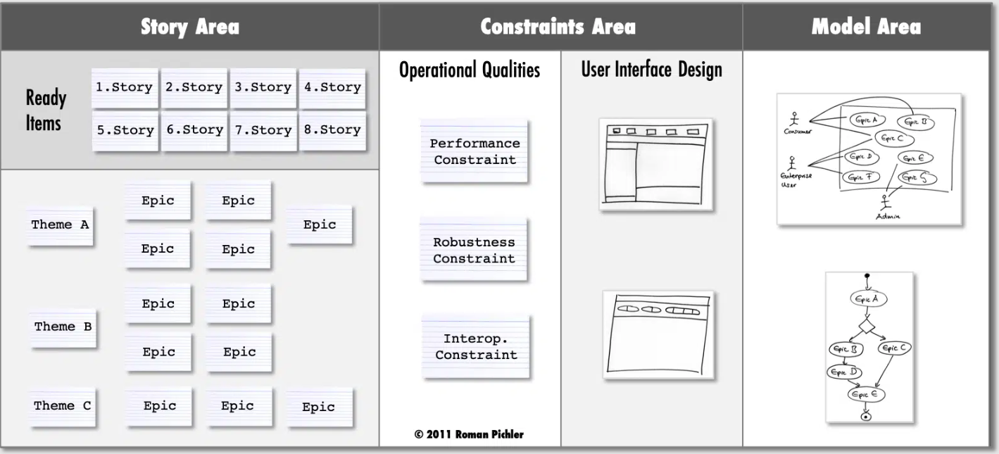

# High Level Design (HLD)

## Définition
Le **High Level Design (HLD)** est une représentation visuelle et simplifiée de l’architecture produit.  
Il met en avant les grandes aires (domaines), contraintes et dépendances, sans entrer dans le détail technique.  

---

## Objectif
- Donner une vue d’ensemble du système à concevoir.  
- Identifier les zones de contraintes (techniques, réglementaires, organisationnelles).  
- Découper en modèles, thèmes et epics.  
- Favoriser un langage commun entre parties prenantes.  

---

## Contenu
Un HLD inclut généralement :
- **Aires de contraintes** : limitations imposées (sécurité, légales, technologiques).  
- **Aires de modèle** : grands domaines fonctionnels ou métiers.  
- **Aire de story** : regroupement des story en cours du sprint, les epic regroupées en thèmes
- **Thèmes** : regroupements stratégiques de besoins.  
- **Epics** : ensembles de fonctionnalités cohérentes.

---

## Exemple
Pour une plateforme e-commerce :  
- Aire de contrainte : paiement sécurisé PCI-DSS.  
- Aire de modèle : gestion catalogue, panier, livraison.  
- Thème : expérience utilisateur.  
- Epic : “Recherche produit avec filtres avancés”.  

---

## Erreurs fréquentes
- Croire que le HLD est figé (il doit évoluer).  
- Descendre trop dans le détail (se transformer en low-level design).  
- Oublier de représenter les contraintes.  
- Ne pas lier HLD aux artefacts produits (roadmap, backlog).  

---

## Ressources
- *Scaled Agile Framework – Architectural Runway*  
- *Domain-Driven Design (DDD) – Context mapping*  
